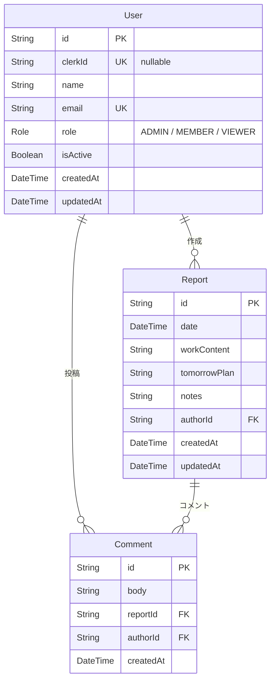

# schema.md — DBスキーマ定義

## Prisma スキーマ（`prisma/schema.prisma`）

```prisma
// Prisma 7: generator provider は "prisma-client"、output でクライアント生成先を指定
generator client {
  provider = "prisma-client"
  output   = "../src/generated/prisma"
}

// Prisma 7: datasource に URL は書かない。URL は prisma.config.ts で管理する
datasource db {
  provider = "postgresql"
}

enum Role {
  ADMIN   // 管理画面フルアクセス
  MEMBER  // 日報作成・編集・コメント（デフォルト）
  VIEWER  // 閲覧・コメントのみ（Phase 7c）
}

model User {
  id        String   @id @default(cuid())
  clerkId   String?  @unique @map("clerk_id")              // Phase 10: Clerk ユーザーID（初回ログイン時に紐付け）
  name      String
  email     String   @unique
  role      Role     @default(MEMBER)                      // Phase 7a
  isActive  Boolean  @default(true) @map("is_active")      // Phase 7a: false でログイン不可
  createdAt DateTime @default(now()) @map("created_at")
  updatedAt DateTime @updatedAt @map("updated_at")

  reports  Report[]
  comments Comment[]
}

model Report {
  id           String   @id @default(cuid())
  date         DateTime                                    // 日付部分のみ使用（時刻は 00:00:00 UTC で統一）
  workContent  String   @map("work_content")               // 作業内容
  tomorrowPlan String   @map("tomorrow_plan")              // 明日の予定
  notes        String   @default("")                       // 感想・課題・問題点（任意）
  createdAt    DateTime @default(now()) @map("created_at")
  updatedAt    DateTime @updatedAt @map("updated_at")

  authorId String  @map("author_id")
  author   User    @relation(fields: [authorId], references: [id])
  comments Comment[]

  @@unique([authorId, date]) // 1ユーザー1日1件制約 + 月次ビュー用インデックスを兼ねる
  @@index([date])            // 日次ビュー用
}

model Comment {
  id        String   @id @default(cuid())
  body      String
  createdAt DateTime @default(now()) @map("created_at")

  reportId String @map("report_id")
  report   Report @relation(fields: [reportId], references: [id])
  authorId String @map("author_id")
  author   User   @relation(fields: [authorId], references: [id])

  @@index([reportId])
}
```

---

## リレーション図



---

## テーブル定義（概要）

### User

| カラム | 型 | 説明 |
|--------|-----|------|
| id | String (CUID) | 主キー |
| clerkId | String? | Clerk ユーザーID（nullable・ユニーク）。初回ログイン時に自動紐付け |
| name | String | 表示名 |
| email | String | ユニーク、Clerk 側のメールと紐付けに使用 |
| role | Role (enum) | `ADMIN` / `MEMBER` / `VIEWER`、デフォルト `MEMBER` |
| isActive | Boolean | `false` でログイン不可（データは保持）、デフォルト `true` |
| createdAt | DateTime | 作成日時 |
| updatedAt | DateTime | 更新日時 |

### Report

| カラム | 型 | 説明 |
|--------|-----|------|
| id | String (CUID) | 主キー |
| date | DateTime | 日報の日付（00:00:00 UTC で保存） |
| workContent | String | 作業内容（必須） |
| tomorrowPlan | String | 明日の予定（必須） |
| notes | String | 感想・課題・問題点（任意、デフォルト空） |
| authorId | String | 外部キー → User.id |
| createdAt | DateTime | 作成日時 |
| updatedAt | DateTime | 更新日時 |

**制約**
- `(authorId, date)` のユニーク制約で1ユーザー1日1件を保証

### Comment

| カラム | 型 | 説明 |
|--------|-----|------|
| id | String (CUID) | 主キー |
| body | String | コメント本文（必須、1〜1000文字） |
| reportId | String | 外部キー → Report.id |
| authorId | String | 外部キー → User.id |
| createdAt | DateTime | 作成日時 |

---

## インデックス設計

| テーブル | インデックス | 用途 |
|----------|------------|------|
| Report | `date` | 日次ビュー（特定日付の全ユーザー日報取得） |
| Report | `(authorId, date)` | ユニーク制約として自動作成。月次ビュー用インデックスを兼ねる |
| Comment | `reportId` | 日報詳細のコメント取得 |

---

## 初期データ（開発用シード）

実行コマンド: `npx tsx prisma/seed.ts`

完全リセットして再投入する場合: `npx prisma migrate reset`

| データ | 件数 | 詳細 |
|--------|------|------|
| User | 6 | 下表参照 |
| Report | 15 | MEMBER 2名 × 今日を基準とした過去 7 日分 + 管理操作対象 1件 |
| Comment | 5 | ユーザー間の相互コメント（VIEWER によるコメントを含む） |

**シードユーザー一覧**

| email | 名前 | ロール | isActive | 用途 |
|-------|------|--------|----------|------|
| bonjiri@example.com | bonjiri | ADMIN | true | 管理操作の実行者。日報なし（管理画面で「最終日報投稿日: なし」の表示確認用） |
| tsukune@example.com | tsukune | MEMBER | true | 日報・コメント・ユーザー分離テストのメインユーザー |
| tebasaki@example.com | tebasaki | MEMBER | true | ユーザー分離テストの「他ユーザー」。日報・コメントあり |
| nankotsu@example.com | nankotsu | VIEWER | true | 日報作成不可・コメントのみ可の確認用 |
| sunagimo@example.com | sunagimo | MEMBER | false | ログイン後 `/auth-error?reason=inactive` リダイレクト・再有効化の確認用 |
| torikawa@example.com | torikawa | MEMBER | true | 管理画面でのロール変更・無効化テスト専用。日報1件あり |

- シードはテスト直前に実行することを想定しており、日報の日付は実行日を基準とした過去 7 日分で作成される
- ユーザーは upsert で投入するため、テスト中に変更されたロール・isActive はシード再実行でリセットされる
- `CLERK_SECRET_KEY` が設定されている場合、シード実行時に Clerk ユーザーも自動作成・紐付けされる（既存ユーザーはスキップ）
- 初期パスワード: `Yakitori2026`
- シードを再実行するとレポート・コメントは全削除して再投入する（ユーザーは upsert のため削除しない）

Neon では開発用と本番用でブランチを分けることができる（無料枠で利用可能）。
