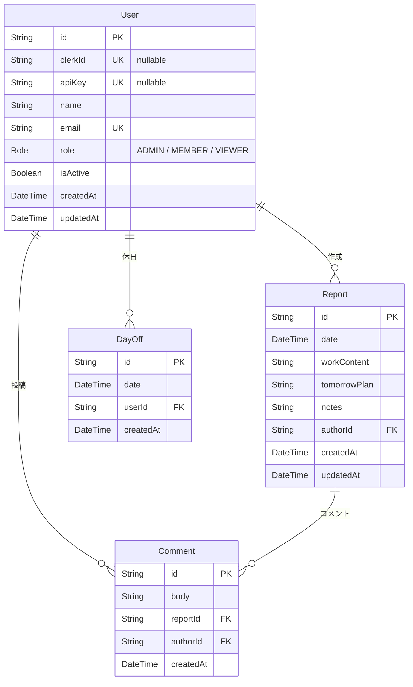

# schema.md — DBスキーマ定義

## Prisma スキーマ

スキーマ定義の本体は [`prisma/schema.prisma`](../prisma/schema.prisma) を唯一の正とする（本ドキュメントには複製しない）。以下は Prisma 7 でスキーマを編集する際の gotcha。

- `generator client` の `provider` は `"prisma-client"`、`output` でクライアント生成先（`src/generated/prisma`）を指定する
- `datasource` に接続 URL は書かない。URL は `prisma.config.ts`（CLI）と `src/lib/prisma.ts`（ランタイム）で管理する（詳細は [architecture.md](architecture.md) の「Prisma 7 の接続構成」を参照）

以降のテーブル定義・リレーション図・インデックスは、スキーマから読み取れる契約情報として整理したもの。

---

## リレーション図

---

## テーブル定義（概要）

### User

| カラム | 型 | 説明 |
|--------|-----|------|
| id | String (CUID) | 主キー |
| clerkId | String? | Clerk ユーザーID（nullable・ユニーク）。初回ログイン時に自動紐付け |
| apiKey | String? | 外部API用キー（nullable・ユニーク）。ユーザーが個人設定で生成・失効 |
| name | String | 表示名 |
| email | String | ユニーク、Clerk 側のメールと紐付けに使用 |
| role | Role (enum) | `ADMIN` / `MEMBER` / `VIEWER`、デフォルト `MEMBER` |
| isActive | Boolean | `false` でログイン不可（データは保持）、デフォルト `true` |
| createdAt | DateTime | 作成日時 |
| updatedAt | DateTime | 更新日時 |

### Report

| カラム | 型 | 説明 |
|--------|-----|------|
| id | String (CUID) | 主キー |
| date | DateTime | 日報の日付（00:00:00 UTC で保存） |
| workContent | String | 作業内容（必須） |
| tomorrowPlan | String | 明日の予定（必須） |
| notes | String | 感想・課題・問題点（任意、デフォルト空） |
| authorId | String | 外部キー → User.id |
| createdAt | DateTime | 作成日時 |
| updatedAt | DateTime | 更新日時 |

**制約**
- `(authorId, date)` のユニーク制約で1ユーザー1日1件を保証

### Comment

| カラム | 型 | 説明 |
|--------|-----|------|
| id | String (CUID) | 主キー |
| body | String | コメント本文（必須、1〜1000文字） |
| reportId | String | 外部キー → Report.id |
| authorId | String | 外部キー → User.id |
| createdAt | DateTime | 作成日時 |

### DayOff

| カラム | 型 | 説明 |
|--------|-----|------|
| id | String (CUID) | 主キー |
| date | DateTime | 休日の日付（00:00:00 UTC で保存） |
| userId | String | 外部キー → User.id |
| createdAt | DateTime | 作成日時 |

**制約**
- `(userId, date)` のユニーク制約で1ユーザー1日1件を保証

---

## カスケード動作

Prisma スキーマに `onDelete` を指定していないため、全リレーションのデフォルトは **`Restrict`**（参照先レコードが存在する間は削除不可）となる。

| リレーション | onDelete | 影響 |
|-------------|----------|------|
| Report → User | Restrict | User 削除前に Report を削除する必要がある |
| Comment → User | Restrict | User 削除前に Comment を削除する必要がある |
| Comment → Report | Restrict | Report 削除前に Comment を削除する必要がある |
| DayOff → User | Restrict | User 削除前に DayOff を削除する必要がある |

**`deleteUser`（ADM-11）実装時の注意：** User を削除する前に、その User が投稿した Comment、Report、および DayOff をアプリケーション側で先に削除すること。

---

## インデックス設計

| テーブル | インデックス | 用途 |
|----------|------------|------|
| Report | `date` | 日次ビュー（特定日付の全ユーザー日報取得） |
| Report | `(authorId, date)` | ユニーク制約として自動作成。月次ビュー用インデックスを兼ねる |
| Comment | `reportId` | 日報詳細のコメント取得 |
| DayOff | `date` | 日付での休日検索 |
| DayOff | `(userId, date)` | ユニーク制約として自動作成。ユーザー別休日取得用インデックスを兼ねる |

