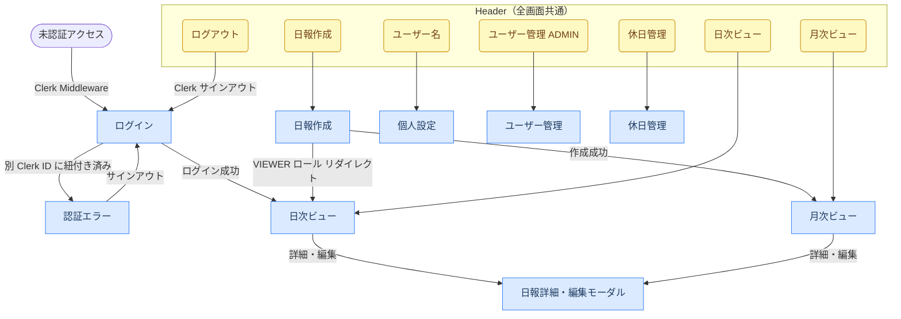

# ui.md — UI設計書

## 画面一覧・遷移

### 画面一覧

| 画面 | パス | レイアウト | アクセス制限 |
|------|------|-----------|------------|
| ログイン | `/login` | ヘッダーなし | 未認証のみ |
| 認証エラー | `/auth-error` | ヘッダーなし | なし |
| 日次ビュー | `/reports/daily` | ヘッダーあり | 要ログイン |
| 月次ビュー | `/reports/monthly` | ヘッダーあり | 要ログイン |
| 日報作成 | `/reports/new` | ヘッダーあり | 要ログイン（VIEWER 不可） |
| 個人設定 | `/settings` | ヘッダーあり | 要ログイン |
| 休日管理 | `/day-off` | ヘッダーあり | 要ログイン |
| ユーザー管理 | `/admin/users` | ヘッダーあり | ADMIN のみ |

### 画面遷移



---

## 機能要件

### 1. 認証

| # | 要件 |
|---|------|
| AUTH-1 | Clerk を使用したメールアドレス + パスワードでログインができる（サインアップは Clerk の Allowlist・Restricted モードで制御） |
| AUTH-2 | ログイン済みユーザーのみ日報・コメントの作成・編集ができる |
| AUTH-3 | 未ログインユーザーは全ページにアクセスできない（リダイレクト） |

### 2. 日報（Report）

| # | 要件 |
|---|------|
| RPT-1 | ログインユーザーは今日の日報を作成できる |
| RPT-2 | 日報は以下の3フィールドで構成される：作業内容 / 明日の予定 / 感想・課題・問題点 |
| RPT-3 | 各フィールドは複数行テキスト（Markdown非対応・プレーンテキスト、将来対応可） |
| RPT-4 | 1ユーザー1日1件の日報のみ作成できる（同日に2件目はエラー） |
| RPT-5 | 作成した日報は自分のみが編集できる |
| RPT-6 | 編集は日付に関わらず可能（過去の日報も編集可） |
| RPT-7 | 日報の削除は行わない（MVP非対応） |
| RPT-8 | ユーザーは休日管理ページで自分の休日を登録・削除できる。ADMIN は他ユーザーの休日も代理設定可能。休日として登録された日は提出率の算出対象から除外される |
| RPT-9 | 提出率は平日（月〜金）のみを分母とし、休日登録がある日はさらに分母から除外する |

### 3. 閲覧

| # | 要件 |
|---|------|
| VIEW-1 | ログイン済みの全ユーザーが他ユーザーの日報を閲覧できる |
| VIEW-2 | **日次ビュー**：指定した日付の全ユーザーの日報を一覧表示できる |
| VIEW-3 | 日次ビューでは表示するユーザーを選択（絞り込み）できる |
| VIEW-4 | **月次ビュー**：指定した月（期間選択可）に自分が投稿した日報を一覧表示できる |
| VIEW-5 | 月次ビューでは他のユーザーの日報も閲覧できる（ユーザー切り替え） |
| VIEW-6 | 日報詳細ページで1件の日報とそのコメントを確認できる |
| VIEW-7 | 日次・月次ビューのユーザー選択（select）は変更時に即時反映する |
| VIEW-8 | 日次・月次ビューの日付入力が有効な値の場合は即時反映し、不正値（不完全・存在しない日付）の場合はURLを更新せず入力フィールドを赤枠で表示する |

### 4. コメント

| # | 要件 |
|---|------|
| CMT-1 | ログイン済みユーザーは任意の日報にコメントを追加できる |
| CMT-2 | コメントはプレーンテキスト（1〜1000文字） |
| CMT-3 | コメントは投稿者本人のみ削除できる |
| CMT-4 | コメントの編集は行わない（MVP非対応） |
| CMT-5 | コメントのスレッド（返信）は行わない（MVP非対応） |

### 5. 個人管理

| # | 要件 |
|---|------|
| PROF-1 | ログイン済みユーザーは自分の名前を変更できる |
| PROF-2 | パスワード変更は Clerk の管理下のため、アプリ内での変更機能は提供しない |
| PROF-3 | メールアドレスは表示のみ（変更不可） |
| PROF-4 | ログイン済みユーザーは外部API連携用の APIキーを生成できる（全ロール対応） |
| PROF-5 | APIキーは再生成できる（既存キーを新しい UUID で上書き） |
| PROF-6 | APIキーは失効できる（DB 上の apiKey を null にする） |
| PROF-7 | APIキーは生成直後のみプレーンテキストで表示され、それ以外はマスク表示する（ページリロード後もマスク） |

### 6. ユーザー管理（管理者機能）

#### 6-1. ロール

| # | 要件 |
|---|------|
| USR-1 | ユーザーは `ADMIN` / `MEMBER` / `VIEWER` のいずれかのロールを持つ |
| USR-2 | デフォルトロールは `MEMBER` とする |
| USR-3 | DB にユーザーが存在しない状態での初回ログイン時は `ADMIN` ロールで自動作成される。2人目以降は `MEMBER`。ただし DB にユーザーが0件のタイミングで複数ユーザーが同時に初回ログインした場合、一時的に複数の `ADMIN` ユーザーが作成される可能性を許容する |
| USR-4 | `VIEWER` ロールのユーザーは日報の閲覧・コメント追加のみ可能（日報作成・編集不可） |
| USR-5 | `ADMIN` ロールのユーザーのみ管理画面にアクセスできる |

#### 6-2. 管理画面

| # | 要件 |
|---|------|
| ADM-1 | 管理者はユーザー一覧を閲覧できる（名前・メール・ロール・登録日・最終日報投稿日） |
| ADM-2 | 管理者は任意のユーザーのロールを変更できる（自分自身の `admin` → 他ロールへの降格は不可） |
| ADM-3 | 管理者はアカウントを無効化できる（日報・コメントのデータは保持し、ログイン不可にする）（自分自身への無効化は不可） |
| ADM-4 | 無効化されたユーザーはアクセス時に `/auth-error?reason=inactive` にリダイレクトされ「アカウントが無効化されています」と表示される |
| ADM-5 | 管理者は無効化済みアカウントを再有効化できる（自分自身への再有効化は不可） |

#### 6-3. ユーザー削除

| # | 要件 |
|---|------|
| ADM-11 | 管理者はアカウントを完全削除できる（日報・コメントを含む）。削除後に同一メール・Clerk アカウントで再ログインした場合は新規 `MEMBER` として自動再作成される |
| ADM-12 | 削除実行には確認として削除対象ユーザーの名前を入力させる |

---

## 画面機能仕様

### ログイン（`/login`）

Clerk の SignIn UI を表示する。メールアドレス＋パスワードで認証し、成功後は日次ビューへ遷移する。

### 認証エラー（`/auth-error`）

アカウントが別の Clerk ID に紐付き済みの場合に表示する。サインアウトボタンのみ提供し、ログイン画面へ誘導する。

### 日次ビュー（`/reports/daily`）

指定した日付に投稿された全ユーザーの日報を一覧表示する。日付フィルターのみ。自分の日報には編集ボタンが表示される。

| 機能 | 説明 |
|------|------|
| 日付フィルター | 日付入力（`<input type="date">`）。有効値で即時反映、不正値は赤枠表示 |
| 表示フィールド切替 | 「本日の作業」「明日の予定」「感想/課題/問題点」をトグルで複数選択。選択したフィールドを固定順（本日の作業 → 明日の予定 → 感想/課題/問題点）でカードに表示。未選択（0個）も可。デフォルトは「感想/課題/問題点」のみ |
| 日報カード | 選択された表示フィールドを全文表示（改行保持）。コメント件数も表示 |
| 編集ボタン | 自分の日報のみ表示。クリックで詳細・編集モーダルを編集モードで開く |
| 詳細ボタン | 全員の日報に表示。クリックで詳細・編集モーダルを開く（ページ遷移なし） |

### 月次ビュー（`/reports/monthly`）

指定した月に投稿された日報を一覧表示する。デフォルトは自分の日報を表示し、ユーザー切り替えで他ユーザーの日報も閲覧できる。

| 機能 | 説明 |
|------|------|
| 月フィルター | 月入力（`<input type="month">`）。有効値で即時反映、不正値は赤枠表示 |
| ユーザーフィルター | 検索付きコンボボックス。テキスト入力でインクリメンタル絞り込み。デフォルトは自分 |
| 表示フィールド切替 | 日次ビューと同じく複数選択トグル（固定順表示・未選択可・デフォルトは感想/課題/問題点） |
| 日報カード | 日付・作成者と、選択された表示フィールドを全文表示（改行保持）。詳細・編集ボタンで詳細・編集モーダルを開く |

### 日報詳細・編集モーダル

日次・月次ビューの一覧から「詳細」「編集」ボタンで開くクライアント側モーダル。URL は変更せず、一覧のコンテキストを保ったまま詳細確認・編集ができる。

| 機能 | 説明 |
|------|------|
| 日報表示 | 一覧が保持する report データをそのまま表示（作業内容・明日の予定・所感） |
| コメント一覧 | モーダルを開いた時にサーバーアクション（`getReportComments`）で遅延取得して表示（Loading / Empty / Error の3状態あり） |
| コメント追加 | モーダル内の `CommentForm` から投稿。送信後 `getReportComments` で再取得しコメント一覧を更新、`router.refresh()` で一覧のコメント件数を同期 |
| コメント削除 | 自分のコメントのみ「削除」ボタンを表示。削除後クライアント側 state から除去して即時反映、`router.refresh()` で一覧のコメント件数を同期 |
| 編集切り替え | 本人の日報のみ「編集」ボタンを表示。同一モーダル内で編集フォームに切り替え、保存成功でモーダル内の表示を更新して一覧を `router.refresh()` で同期 |
| 閉じる操作 | ×ボタン・背景クリック・Escape キー |

### 日報作成（`/reports/new`）

今日の日報を新規作成する。VIEWER ロールはアクセス不可（日次ビューへリダイレクト）。

| フィールド | 必須 | 説明 |
|-----------|------|------|
| 日付 | ✅ | デフォルトは今日の日付 |
| 本日の作業内容 | ✅ | 最大5000文字 |
| 明日の予定 | ✅ | 最大5000文字 |
| 所感・連絡事項 | — | 最大5000文字、任意 |

同日に既存の日報がある場合は 409 エラーを表示する。

### 個人設定（`/settings`）

自分の表示名を変更する。メールアドレスは表示のみ（変更不可）。パスワード変更は Clerk 管理のためアプリ内では提供しない。

外部API連携用のAPIキーを管理できる（Phase 11）。

**APIキーセクション**

| 状態 | 表示内容 |
|------|---------|
| キー未生成 | 「生成する」ボタンを表示 |
| キー生成済み | マスク表示（`type="password"`）+ 「表示/隠す」トグル + 「再生成」「失効」ボタン |
| 生成直後 | プレーンテキスト表示（`type="text"`）+ 「隠す」ボタン。ページリロード後はマスク表示に戻る |

- 全ロール（ADMIN / MEMBER / VIEWER）が操作可能
- 「失効」後は「生成する」ボタンに戻る
- 「再生成」は既存キーを新しい UUID で上書きする

### 休日管理（`/day-off`）

カレンダー UI で休日を登録・解除する。登録した休日は提出状況ビューの提出率算出から除外される（上記「機能要件」RPT-8 / RPT-9）。ADMIN は他ユーザーの休日も代理設定可能。

| 機能 | 説明 |
|------|------|
| 月ナビゲーション | 「◀ / ▶」ボタンで前月・翌月へ移動。初期表示は今月 |
| 日付セル | クリックで休日を登録／解除（トグル）。登録済みは赤系（`bg-red-100 text-red-700`）で強調、当日は枠線で示す |
| 楽観的更新 | クリック時に即座に表示を切り替え、Server Action 失敗時はロールバックしてエラー表示 |
| ユーザー選択（ADMIN のみ） | 検索付きコンボボックスで対象ユーザーを切り替え（`?userId=` クエリ駆動）。他人のカレンダー編集中は「○○さんの休日を編集しています」を表示 |

- 土日も平日と同様にクリックで登録可能
- 1ユーザー1日1件（`DayOff` の `(userId, date)` ユニーク制約）
- 不正な `userId` クエリは自分にフォールバック

### ユーザー管理（`/admin/users`）

ADMIN のみアクセス可能。全ユーザーの一覧を表示し、ロール変更・有効化/無効化を操作できる。

| 表示項目 | 説明 |
|---------|------|
| 名前・メール | ユーザー情報 |
| ロール | `ADMIN` / `MEMBER` / `VIEWER`。ドロップダウンで変更可 |
| 登録日 | アカウント作成日 |
| 最終日報投稿日 | 直近の日報日付 |
| 有効化/無効化 | トグル操作。自分自身への操作は不可 |

無効化ユーザーはデフォルト非表示。「無効化ユーザーを表示」チェックボックスで表示を切り替えられる（クライアントサイド）。

---

## 各画面の表示状態（Loading / Empty / Error）

### ログイン（`/login`）

| 状態 | 表示内容 |
|------|---------|
| Normal | Clerk の SignIn UI を表示 |
| Error | Clerk が認証エラーをインライン表示（Clerk 管理） |

### 認証エラー（`/auth-error`）

| 状態 | 表示内容 |
|------|---------|
| Normal | エラーメッセージとサインアウトボタンを表示 |

### 日次ビュー（`/reports/daily`）

| 状態 | 表示内容 |
|------|---------|
| Loading | `loading.tsx` によるフォールバック |
| Normal | 日報カード一覧を表示 |
| Empty | 「この日の日報はありません」を表示 |
| Error | サーバーコンポーネントで例外が発生した場合は Next.js の `error.tsx` フォールバックページを表示 |

### 月次ビュー（`/reports/monthly`）

| 状態 | 表示内容 |
|------|---------|
| Loading | `loading.tsx` によるフォールバック |
| Normal | 日報カード一覧を表示 |
| Empty | 「この期間の日報はありません」を表示 |
| Error | サーバーコンポーネントで例外が発生した場合は Next.js の `error.tsx` フォールバックページを表示 |

### 日報作成（`/reports/new`）

| 状態 | 表示内容 |
|------|---------|
| Normal | 空フォームを表示（日付はデフォルト今日） |
| Submitting | 送信ボタンを「保存中...」に変更・無効化 |
| ValidationError | HTML ネイティブバリデーション（`required` 属性など）によるブラウザ標準のエラー表示 |
| Error | フォーム上部に `<ErrorMessage>` を表示（409 重複など） |

### 個人設定（`/settings`）

| 状態 | 表示内容 |
|------|---------|
| Normal | 現在の名前・メールアドレスで初期化されたフォームを表示 |
| Submitting | 送信ボタンを「保存中...」に変更・無効化 |
| ValidationError | フィールド下にエラーメッセージを表示 |
| Success | 保存完了フィードバックを表示 |

**APIキーセクション状態**

| 状態 | 表示内容 |
|------|---------|
| 未生成 | 「生成する」ボタンのみ表示 |
| 生成中 / 処理中 | ボタンを「生成中...」/「処理中...」に変更・無効化 |
| 生成済み | マスク入力 + 「表示/隠す」「再生成」「失効」ボタン |
| Error | `<ErrorMessage>` にエラーメッセージを表示 |

### 休日管理（`/day-off`）

| 状態 | 表示内容 |
|------|---------|
| Normal | 今月のカレンダーを表示。登録済み休日は赤系（`bg-red-100 text-red-700`）で強調。ADMIN はユーザー選択コンボボックスを上部に表示 |
| Empty | 休日未登録でもカレンダーは常に表示（専用の空状態なし） |
| Submitting | 操作中の日付セルを半透明・無効化（楽観的更新のため表示自体は即時切替） |
| Error | Server Action 失敗時はカレンダー上部にエラーメッセージを表示し、表示をロールバック |

### ユーザー管理（`/admin/users`）

| 状態 | 表示内容 |
|------|---------|
| Normal | ユーザー一覧テーブルを表示 |
| Empty | ユーザーが存在しない場合は空の `<tbody>` を表示（専用メッセージなし） |
| Error | サーバーコンポーネントで例外が発生した場合は Next.js の `error.tsx` フォールバックページを表示 |

---

## UI 規約

### ページ構造の共通パターン

```tsx
// ページ全体のラッパー
<div className="min-h-screen bg-zinc-50 py-10">
  <div className="mx-auto max-w-[2xl|3xl|5xl] space-y-6 px-4">
    {/* カード */}
    <div className="rounded-lg bg-white p-[6|8] shadow-sm">
      ...
    </div>
  </div>
</div>
```

### ボタン

| 種別 | クラス | 用途 |
|------|--------|------|
| プライマリ | `rounded-md bg-zinc-900 px-4 py-2 text-sm font-medium text-white hover:bg-zinc-700 disabled:opacity-50` | 保存・作成など主要アクション |
| セカンダリ | `rounded-md border border-zinc-300 px-4 py-2 text-sm font-medium text-zinc-700 hover:bg-zinc-50` | キャンセル・編集など補助アクション |
| アクション（青） | `rounded-md bg-blue-600 px-4 py-2 text-sm font-medium text-white hover:bg-blue-700 disabled:opacity-50` | 管理操作（ユーザー追加・招待発行） |
| 危険（赤） | `rounded-md bg-red-600 px-4 py-2 text-sm font-medium text-white hover:bg-red-700` | 削除・無効化など破壊的操作 |
| 小サイズ | `rounded-md bg-zinc-900 px-2.5 py-1 text-xs font-medium text-white hover:bg-zinc-700` | 一覧内のアクション（詳細・編集） |

### フォーム入力

```tsx
// 通常状態
className="rounded-md border border-zinc-300 px-3 py-2 text-sm shadow-sm focus:border-zinc-500 focus:outline-none focus:ring-1 focus:ring-zinc-500"

// エラー状態（バリデーション失敗時）
className="... border-red-500"
```

### フィードバックパターン

| 状態 | 表示方法 |
|------|---------|
| エラー | `<ErrorMessage>` コンポーネント（`bg-red-50 text-red-600`） |
| 送信中 | ボタンテキスト変更（例: `"保存中..."`) + `disabled` + `opacity-50` |
| 空状態 | `<p className="text-sm text-zinc-500">〇〇はありません</p>` |
| 操作完了 | テキスト一時変更（例: 「コピー」→「コピー済み」、2秒後に元に戻す） |

### フォームラベル

```tsx
<label className="block text-sm font-medium text-zinc-700">
  ラベル名
  {/* 任意項目の場合 */}
  <span className="font-normal text-zinc-400">（任意）</span>
</label>
```
