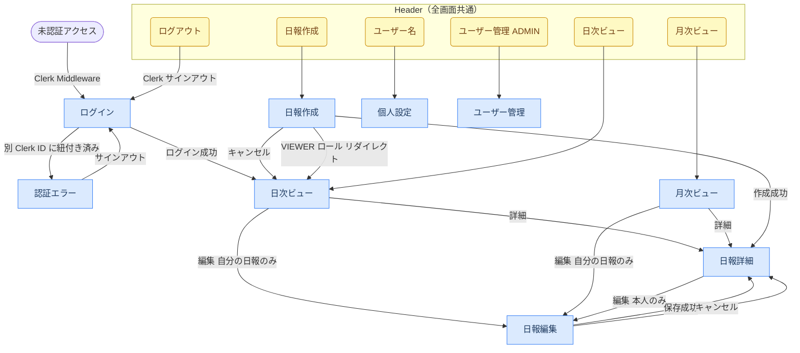

# ui.md — UI設計書

## 画面一覧・遷移

### 画面一覧

| 画面 | パス | レイアウト | アクセス制限 |
|------|------|-----------|------------|
| ログイン | `/login` | ヘッダーなし | 未認証のみ |
| 認証エラー | `/auth-error` | ヘッダーなし | なし |
| 日次ビュー | `/reports/daily` | ヘッダーあり | 要ログイン |
| 月次ビュー | `/reports/monthly` | ヘッダーあり | 要ログイン |
| 日報作成 | `/reports/new` | ヘッダーあり | 要ログイン（VIEWER 不可） |
| 日報詳細 | `/reports/[id]` | ヘッダーあり | 要ログイン |
| 日報編集 | `/reports/[id]/edit` | ヘッダーあり | 要ログイン（本人のみ） |
| 個人設定 | `/settings` | ヘッダーあり | 要ログイン |
| ユーザー管理 | `/admin/users` | ヘッダーあり | ADMIN のみ |

### 画面遷移



---

## 画面機能仕様

### ログイン（`/login`）

Clerk の SignIn UI を表示する。メールアドレス＋パスワードで認証し、成功後は日次ビューへ遷移する。

### 認証エラー（`/auth-error`）

アカウントが別の Clerk ID に紐付き済みの場合に表示する。サインアウトボタンのみ提供し、ログイン画面へ誘導する。

### 日次ビュー（`/reports/daily`）

指定した日付の全ユーザーの日報を一覧表示する。日付入力とユーザー選択でフィルタリングできる。自分の日報には編集ボタンが表示される。

| 機能 | 説明 |
|------|------|
| 日付フィルター | 日付入力（`<input type="date">`）。有効値で即時反映、不正値は赤枠表示 |
| ユーザーフィルター | ユーザー選択（`<select>`）。変更で即時反映 |
| 日報カード | 作業内容・明日の予定を抜粋表示。コメント件数も表示 |
| 編集ボタン | 自分の日報のみ表示 |
| 詳細ボタン | 全員の日報に表示。日報詳細へ遷移 |

### 月次ビュー（`/reports/monthly`）

指定した月に投稿された日報を一覧表示する。デフォルトは自分の日報を表示し、ユーザー切り替えで他ユーザーの日報も閲覧できる。

| 機能 | 説明 |
|------|------|
| 月フィルター | 月入力（`<input type="month">`）。有効値で即時反映、不正値は赤枠表示 |
| ユーザーフィルター | ユーザー選択（`<select>`）。デフォルトは自分 |
| 日報カード | 日付・作成者・作業内容・明日の予定を抜粋表示 |

### 日報作成（`/reports/new`）

今日の日報を新規作成する。VIEWER ロールはアクセス不可（日次ビューへリダイレクト）。

| フィールド | 必須 | 説明 |
|-----------|------|------|
| 日付 | ✅ | デフォルトは今日の日付 |
| 本日の作業内容 | ✅ | 最大5000文字 |
| 明日の予定 | ✅ | 最大5000文字 |
| 所感・連絡事項 | — | 最大5000文字、任意 |

同日に既存の日報がある場合は 409 エラーを表示する。

### 日報詳細（`/reports/[id]`）

1件の日報の全フィールドとコメント一覧を表示する。本人の日報には編集ボタンが表示される。

| 機能 | 説明 |
|------|------|
| 日報表示 | 作業内容・明日の予定・所感を全文表示（改行保持） |
| コメント一覧 | 投稿者名・本文・投稿日時を表示。自分のコメントには削除ボタン |
| コメント追加 | 1〜1000文字のプレーンテキスト |

### 日報編集（`/reports/[id]/edit`）

自分の日報を編集する。他ユーザーの日報は編集不可（サーバー側で authorId を検証）。

フィールド構成は日報作成と同一。保存成功後は日報詳細へ遷移する。

### 個人設定（`/settings`）

自分の表示名を変更する。メールアドレスは表示のみ（変更不可）。パスワード変更は Clerk 管理のためアプリ内では提供しない。

### ユーザー管理（`/admin/users`）

ADMIN のみアクセス可能。全ユーザーの一覧を表示し、ロール変更・有効化/無効化を操作できる。

| 表示項目 | 説明 |
|---------|------|
| 名前・メール | ユーザー情報 |
| ロール | `ADMIN` / `MEMBER` / `VIEWER`。ドロップダウンで変更可 |
| 登録日 | アカウント作成日 |
| 最終日報投稿日 | 直近の日報日付 |
| 直近30日提出率 | 30日間の日報提出率（%） |
| 有効化/無効化 | トグル操作。自分自身への操作は不可 |

---

## 各画面の表示状態（Loading / Empty / Error）

### ログイン（`/login`）

| 状態 | 表示内容 |
|------|---------|
| Normal | Clerk の SignIn UI を表示 |
| Error | Clerk が認証エラーをインライン表示（Clerk 管理） |

### 認証エラー（`/auth-error`）

| 状態 | 表示内容 |
|------|---------|
| Normal | エラーメッセージとサインアウトボタンを表示 |

### 日次ビュー（`/reports/daily`）

| 状態 | 表示内容 |
|------|---------|
| Loading | `loading.tsx` によるフォールバック |
| Normal | 日報カード一覧を表示 |
| Empty | 「この日の日報はありません」を表示 |
| Error | サーバーコンポーネントで例外が発生した場合は Next.js の `error.tsx` フォールバックページを表示 |

### 月次ビュー（`/reports/monthly`）

| 状態 | 表示内容 |
|------|---------|
| Loading | `loading.tsx` によるフォールバック |
| Normal | 日報カード一覧を表示 |
| Empty | 「この期間の日報はありません」を表示 |
| Error | サーバーコンポーネントで例外が発生した場合は Next.js の `error.tsx` フォールバックページを表示 |

### 日報作成（`/reports/new`）

| 状態 | 表示内容 |
|------|---------|
| Normal | 空フォームを表示（日付はデフォルト今日） |
| Submitting | 送信ボタンを「保存中...」に変更・無効化 |
| ValidationError | HTML ネイティブバリデーション（`required` 属性など）によるブラウザ標準のエラー表示 |
| Error | フォーム上部に `<ErrorMessage>` を表示（409 重複など） |

### 日報詳細（`/reports/[id]`）

| 状態 | 表示内容 |
|------|---------|
| Loading | `loading.tsx` によるフォールバック |
| Normal | 日報全文・コメント一覧を表示 |
| Empty（コメントなし） | 「コメントはありません」を表示 |
| Error | 404 の場合は Next.js の `notFound()` |

### 日報編集（`/reports/[id]/edit`）

| 状態 | 表示内容 |
|------|---------|
| Normal | 既存データで初期化されたフォームを表示 |
| Submitting | 送信ボタンを「保存中...」に変更・無効化 |
| ValidationError | 各フィールド下にエラーメッセージ（`text-red-500`）を表示 |
| Error | フォーム上部に `<ErrorMessage>` を表示 |

### 個人設定（`/settings`）

| 状態 | 表示内容 |
|------|---------|
| Normal | 現在の名前・メールアドレスで初期化されたフォームを表示 |
| Submitting | 送信ボタンを「保存中...」に変更・無効化 |
| ValidationError | フィールド下にエラーメッセージを表示 |
| Success | 保存完了フィードバックを表示 |

### ユーザー管理（`/admin/users`）

| 状態 | 表示内容 |
|------|---------|
| Normal | ユーザー一覧テーブルを表示 |
| Empty | ユーザーが存在しない場合は空の `<tbody>` を表示（専用メッセージなし） |
| Error | サーバーコンポーネントで例外が発生した場合は Next.js の `error.tsx` フォールバックページを表示 |

---

## レイアウト構成

### layout.tsx 階層

```
src/app/layout.tsx（RootLayout）
  ClerkProvider
  └─ html[lang="ja"]
       └─ body（Geist フォント）
            ├─ src/app/(auth)/login/[[...rest]]/page.tsx  ヘッダーなし
            ├─ src/app/auth-error/page.tsx                ヘッダーなし
            ├─ src/app/reports/layout.tsx（ReportsLayout）
            │    Header
            │    └─ /reports/* の各ページ
            ├─ src/app/admin/layout.tsx（AdminLayout）
            │    Header
            │    └─ /admin/* の各ページ
            └─ src/app/settings/page.tsx                  Header を直接インポートして使用
```

### ページ幅

| 幅クラス | 使用箇所 |
|---------|---------|
| `max-w-2xl` | 日報作成・編集・詳細、個人設定 |
| `max-w-3xl` | 日次ビュー・月次ビュー |
| `max-w-5xl` | ヘッダー内コンテンツ、ユーザー管理 |

---

## コンポーネント一覧

### 共通コンポーネント（`src/components/`）

| コンポーネント | 種別 | 用途 | 使用箇所 |
|--------------|------|------|---------|
| `Header` | Server Component | ナビゲーション・ユーザー名・ログアウト。ロールに応じてメニュー変化 | ReportsLayout, AdminLayout, SettingsPage |
| `SignOutButton` | Client Component | Clerk SignOutButton のラッパー。ログアウト後 `/login` にリダイレクト | Header, AuthErrorPage |
| `ErrorMessage` | Server/Client 両対応 | `message: string \| null` を受け取り、null なら非表示。エラー表示に統一して使用 | ReportNewForm, ReportEditForm, SettingsForm 等 |

### ページ内コンポーネント

| コンポーネント | 種別 | 用途 |
|--------------|------|------|
| `DailyFilter` | Client Component | 日次ビューの日付・ユーザー絞り込み。変更時に `router.push()` |
| `MonthlyFilter` | Client Component | 月次ビューの月・ユーザー絞り込み。変更時に `router.push()` |
| `ReportNewForm` | Client Component | 日報作成フォーム。送信後 `/reports/[id]` にリダイレクト |
| `ReportEditForm` | Client Component | 日報編集フォーム。送信後 `/reports/[id]` にリダイレクト |
| `CommentForm` | Client Component | コメント追加フォーム。送信後ページをリロード |
| `CommentDeleteButton` | Client Component | コメント削除ボタン。本人のコメントのみ表示 |
| `UserTable` | Client Component | ユーザー一覧テーブル。ロール変更・有効化/無効化操作を含む |
| `SettingsForm` | Client Component | 名前変更フォーム |

### ローディング（`loading.tsx`）

以下のルートに `loading.tsx` を配置し、サーバーサイドデータ取得中のフォールバックを提供する。

- `src/app/reports/[id]/loading.tsx`
- `src/app/reports/daily/loading.tsx`
- `src/app/reports/monthly/loading.tsx`

---

## UI 規約

### ページ構造の共通パターン

```tsx
// ページ全体のラッパー
<div className="min-h-screen bg-zinc-50 py-10">
  <div className="mx-auto max-w-[2xl|3xl|5xl] space-y-6 px-4">
    {/* カード */}
    <div className="rounded-lg bg-white p-[6|8] shadow-sm">
      ...
    </div>
  </div>
</div>
```

### ボタン

| 種別 | クラス | 用途 |
|------|--------|------|
| プライマリ | `rounded-md bg-zinc-900 px-4 py-2 text-sm font-medium text-white hover:bg-zinc-700 disabled:opacity-50` | 保存・作成など主要アクション |
| セカンダリ | `rounded-md border border-zinc-300 px-4 py-2 text-sm font-medium text-zinc-700 hover:bg-zinc-50` | キャンセル・編集など補助アクション |
| アクション（青） | `rounded-md bg-blue-600 px-4 py-2 text-sm font-medium text-white hover:bg-blue-700 disabled:opacity-50` | 管理操作（ユーザー追加・招待発行） |
| 危険（赤） | `rounded-md bg-red-600 px-4 py-2 text-sm font-medium text-white hover:bg-red-700` | 削除・無効化など破壊的操作 |
| 小サイズ | `rounded-md bg-zinc-900 px-2.5 py-1 text-xs font-medium text-white hover:bg-zinc-700` | 一覧内のアクション（詳細・編集） |

### フォーム入力

```tsx
// 通常状態
className="rounded-md border border-zinc-300 px-3 py-2 text-sm shadow-sm focus:border-zinc-500 focus:outline-none focus:ring-1 focus:ring-zinc-500"

// エラー状態（バリデーション失敗時）
className="... border-red-500"
```

### フィードバックパターン

| 状態 | 表示方法 |
|------|---------|
| エラー | `<ErrorMessage>` コンポーネント（`bg-red-50 text-red-600`） |
| 送信中 | ボタンテキスト変更（例: `"保存中..."`) + `disabled` + `opacity-50` |
| 空状態 | `<p className="text-sm text-zinc-500">〇〇はありません</p>` |
| 操作完了 | テキスト一時変更（例: 「コピー」→「コピー済み」、2秒後に元に戻す） |

### フォームラベル

```tsx
<label className="block text-sm font-medium text-zinc-700">
  ラベル名
  {/* 任意項目の場合 */}
  <span className="font-normal text-zinc-400">（任意）</span>
</label>
```
